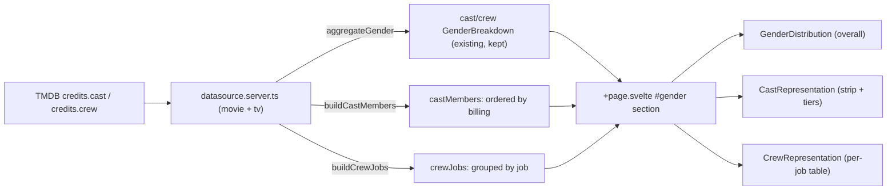

# Nuanced gender representation

> Goal: surface how the movie industry under-represents women not just in aggregate, but in the roles that carry the most weight. The current overall gender split stays as a headline; two new components add a billing-order cast view and a per-job crew table.

## Why

Today [tmdb.ts](../../src/lib/server/integrations/tmdb.ts) collapses TMDB credits into `GenderBreakdown` counts via `aggregateGender`, and the raw cast/crew arrays (with `order`, `job`, `department`, names) are thrown away. The single [genderDistribution.svelte](../../src/lib/components/movies/facts/genderDistribution.svelte) component shows only an overall split. To show that the _important_ roles skew male, we must keep more of the raw credits and derive two new structures.

The overall `GenderDistribution` headline stays; the two new components sit beneath it in the existing `#gender` section on both detail pages (movie + TV).

## Data flow

## 1. Types — [media.ts](../../src/lib/media/types/media.ts)

Add client-safe types and extend the shared shape (inherited by both `Movie` and `Series`):

- `type GenderCategory = 'female' | 'male' | 'nonBinary' | 'unknown'`
- `interface CastMember { name: string; gender: GenderCategory; order: number }`
- `interface CrewJobGroup { job: string; department: string; breakdown: GenderBreakdown }`
- Extend `MediaDetail` with `castMembers: CastMember[]` (sorted by `order` asc) and `crewJobs: CrewJobGroup[]`.

## 2. Server derivation — [tmdb.ts](../../src/lib/server/integrations/tmdb.ts)

Add pure functions next to `aggregateGender` (keep it as-is for the overall view):

- `genderCategory(n: number): GenderCategory` — maps 0/1/2/3 → unknown/female/male/nonBinary.
- `buildCastMembers(cast)` — map each entry to `{ name, gender: genderCategory(...), order }`, sort by `order` ascending (stable; TMDB orders can have gaps).
- `buildCrewJobs(crew)` — group entries by `job`, aggregate gender per group (reusing the `aggregateGender` logic), carry `department`; a person counted once per job they hold (per the "several crew entities can share a job" requirement). Sort by `department`, then by group `total` descending.

## 3. Wire datasources (both pages)

In [movie datasource.server.ts](../../src/routes/movie/[movieId]/datasource.server.ts) and [tv datasource.server.ts](../../src/routes/tv/[seriesId]/datasource.server.ts): after the existing `aggregateGender` calls, also compute `castMembers = buildCastMembers(rawCast)` and `crewJobs = buildCrewJobs(rawCrew)` from `data.credits?.cast/crew`, and add both to the returned object.

## 4. Cast component — `src/lib/components/movies/facts/castRepresentation.svelte`

Combined view from `castMembers`:

- **Headline + tier stats:** Leads (top 5 by `order`), Supporting (6–15), Background (rest). Per tier show a gender stacked mini-bar + counts, making representation by importance obvious. Plus a one-line "Women in top 10 billed: N/10".
- **Billing-order strip:** a wrapping row of one small cell per cast member, left→right in `order`, colored by gender — the front of the line (leads) visibly dominated by one gender. `title`/`aria-label` per cell shows name + billing position.
- Legend + `total === 0` empty state, mirroring `genderDistribution`. Reuse the existing `--brand` / `--seg-male` / `--accent-bg` / `--border` segment tokens so colors match the overall chart.

## 5. Crew component — `src/lib/components/movies/facts/crewRepresentation.svelte`

A table modeled on [dddTags.svelte](../../src/lib/components/movies/metrics/dddTags.svelte) (CSS-grid rows, small-caps header row, zebra striping, mobile stack): each row is a job from `crewJobs` — columns Job | Department | gender stacked bar | counts (W/M/NB/?). Sorted as produced by `buildCrewJobs` (clustered by department). `crewJobs.length === 0` empty state.

## 6. Page wiring — both `+page.svelte`

In the `#gender` section of [movie +page.svelte](../../src/routes/movie/[movieId]/+page.svelte) and [tv +page.svelte](../../src/routes/tv/[seriesId]/+page.svelte), keep `<GenderDistribution>` as the overall headline, then add labeled subsections rendering `<CastRepresentation castMembers={media.castMembers} />` and `<CrewRepresentation crewJobs={media.crewJobs} />`.

## 7. Tests — [datasource.spec.ts](../../src/lib/server/integrations/__tests__/datasource.spec.ts)

Add unit cases for `buildCastMembers` (ordering, gender mapping) and `buildCrewJobs` (grouping, per-job aggregation, sort order), alongside the existing `aggregateGender` tests.

## 8. Docs + verification

Update [architecture.md](../architecture.md): new `media.ts` types, new `tmdb.ts` functions, the two new `movies/facts/*` components, and the `MediaDetail` additions. Run the baseline: `bun run check` (0 errors), `bun run test:unit` (all pass), `bun run build` (clean).
